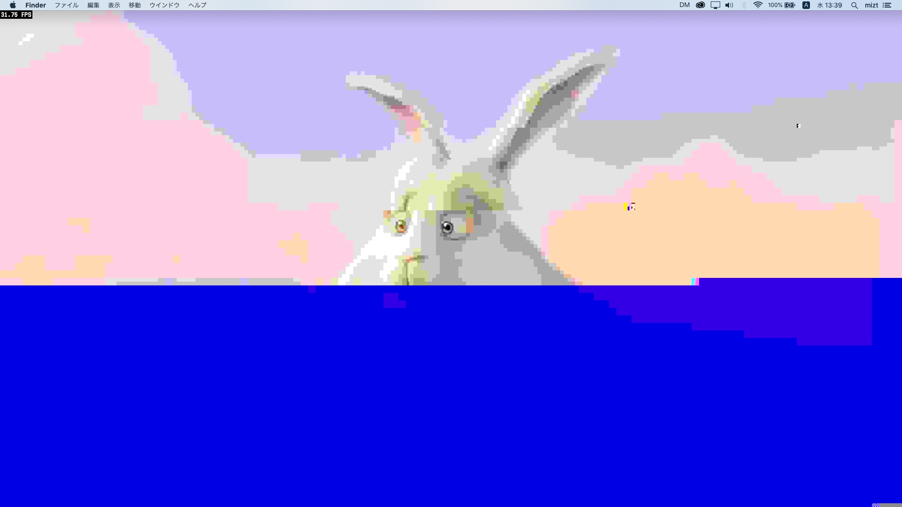

# jpeg

2011 -

### Usage

	int quality = 100;
	int width = 1920;
	int height = 1080;
	int components = 3;
	unsigned char *jpg = new unsigned char[width*height*components];
	int size = JPEG::encode((char *)jpg,(char *)src,width,height,quality);
	/*
	bool sos = false;
	for(int k=0; k<size-1; k++) {
		if(sos) {		
			if(jpg[k]==0xFF&&jpg[k+1]==0xD9) {
				break;
			}
			else if(jpg[k]==0xFF&&jpg[k+1]!=0x00) { k++; }
			else {
				if(!random()%1000) jpg[k]=2+random()%252;
			}
		}
		else {
			if(jpg[k]==0xFF&&jpg[k+1]==0xDA) sos = true;
		}
	}
	*/
	JPEG::decode(dst,jpg,size);
	

### Dependencies

[libjpeg-turbo](https://libjpeg-turbo.org/)
